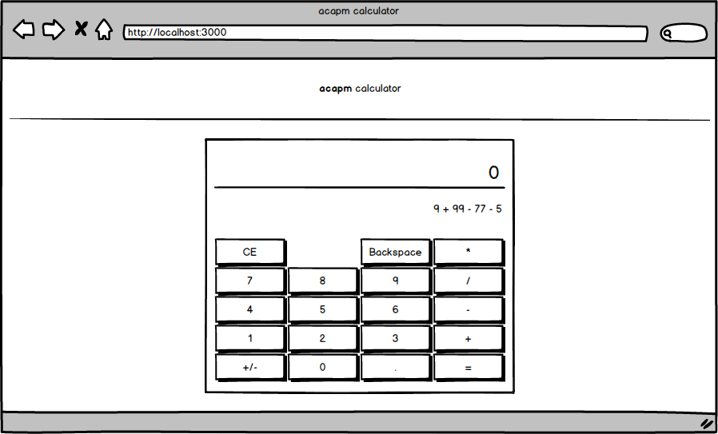

# *acapm* front

This is a simple calculator web app.

It looks something like this:  

Even though you can see the sign flip button, multiplication, division and fractions on its' UI it only supports *addition* and *subtraction*.

Really simple, nothing fancy.

This project was bootstrapped with [Create React App](https://github.com/facebook/create-react-app).

## To run

> `npm start`

## To test

> `npm test`
